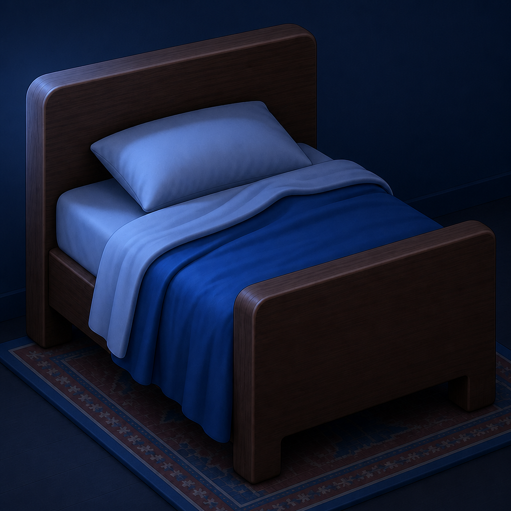
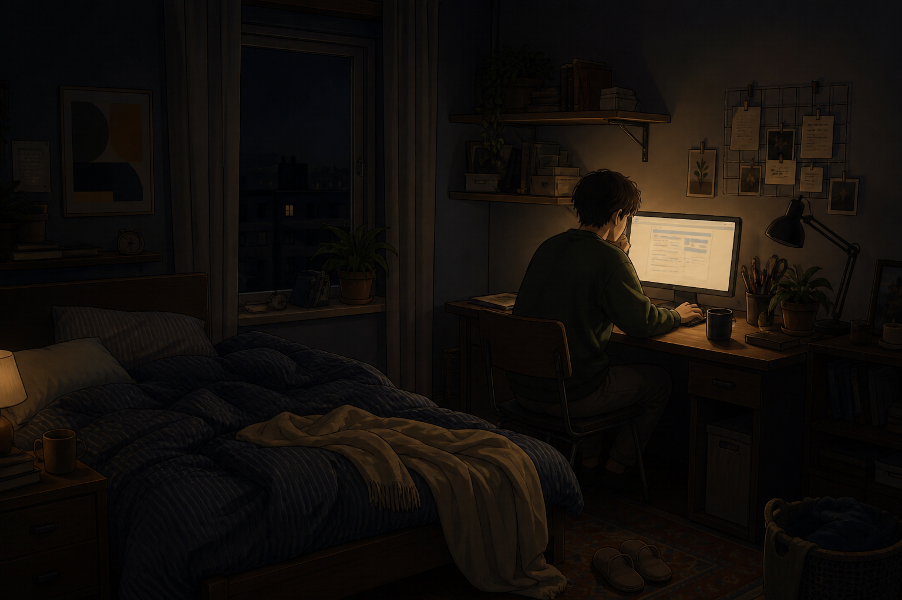

<p align="center">
  
</p>

<h1 align="center">Bed</h1>

<p align="center">
  Late-night radio in the Mac menu bar.<br>
  SomaFM deep house, lounge, and downtempo — plus Nightride synthwave.
</p>

<p align="center">
  <a href="https://github.com/clodoan/bed/releases/latest"><strong>Download Bed.app.zip</strong></a>
</p>

<p align="center">
  
</p>

No account. No API key. Skip cycles stations. The stations are listener-supported —
please [donate to SomaFM](https://somafm.com/support/) and
[support Nightride on Patreon](https://www.patreon.com/nightridefm).

## Install

Download **Bed.app.zip** from the
[latest release](https://github.com/clodoan/bed/releases/latest).
That is the app. Do not use **Source code (zip)** — that is just this repo.

Unzip, drag `Bed.app` into `/Applications`, then **right-click → Open** the
first time (unsigned). Apple Silicon, macOS 14+.

Look for the bed in the menu bar.

## Stations

- Beat Blender — deep house & downtempo
- The Trip — progressive house & trance
- Groove Salad — ambient downtempo chill
- Fluid — future soul & liquid beats
- Illinois Street Lounge — retro cocktail lounge
- Nightride — synthwave

## Build from source

```sh
./scripts/package.sh
```
