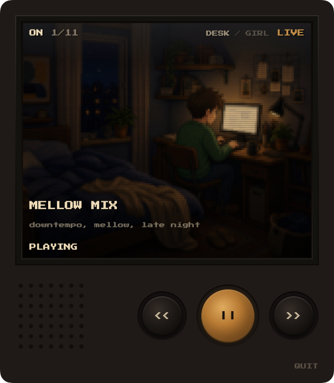
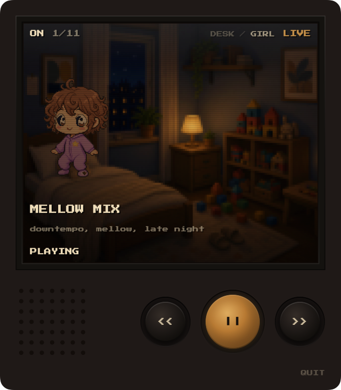

<p align="center">
  
</p>

<h1 align="center">Lo fi house</h1>

<p align="center">
  Late-night radio in the Mac menu bar.<br>
  House, chill, and desk music from listener-supported stations.
</p>

<p align="center">
  <a href="https://github.com/clodoan/bed/releases/latest/download/LofiHouse.zip"><strong>Download LofiHouse.zip</strong></a>
</p>

<p align="center">
  
  &nbsp;
  
</p>

No account. No API key. Click the house in the menu bar, press play.
Skip cycles stations. The LCD swaps a night desk for a girl in the same room.

Lo fi house is a tuner — it opens each station's published stream. The music is
still theirs. The stations are listener-supported — please
[donate to Radio Paradise](https://radioparadise.com/donate),
[donate to Chilltrax](https://www.chilltrax.com),
[support NTS](https://www.nts.live/supporters),
[open Dogglounge](https://dogglounge.com),
[donate to Isla Negra](https://www.radioislanegra.com),
[donate to 9128](https://9128.live/guestbook/donate), and
[support Nightride on Patreon](https://www.patreon.com/nightridefm).

## Install

Apple Silicon, macOS 14+.

```sh
curl -fsSL https://raw.githubusercontent.com/clodoan/bed/main/scripts/install.sh | bash
```

That is the path that works. It downloads **LofiHouse.zip** from the
[latest release](https://github.com/clodoan/bed/releases/latest), copies
`Lo fi house.app` into `/Applications`, and clears the quarantine flag macOS
puts on GitHub downloads — the one that says the file cannot be installed.

Or [download LofiHouse.zip](https://github.com/clodoan/bed/releases/latest/download/LofiHouse.zip)
yourself. Unzip, open **Install Lo fi house**, double-click **Install.command**.
Do not open the house icon from that folder.

Do not use **Source code (zip)** — that is this repo, not the app. Do not use
the green **Code → Download ZIP** button either.

## Stations

- Mellow Mix — downtempo, mellow, late night (Radio Paradise)
- Chilltrax — chillout, downtempo, soft house (Chilltrax)
- Poolside — balearic, boogie, lounge (NTS)
- 4 To The Floor — house, Chicago to Detroit (NTS)
- Slow Focus — ambient, drone, for work (NTS)
- Low Key — quiet hip-hop, late night (NTS)
- Dogglounge — deep house (Dogglounge)
- Isla Negra — downtempo, ambient (Radio Isla Negra)
- 9128 — ambient, drone (ASIP)
- Chillsynth — chill synth, night drive (Nightride FM)
- Nightride — synthwave (Nightride FM)

## Build from source

Xcode 16+ / Swift 6, Apple Silicon.

```sh
./scripts/bundle.sh
```

Puts `Lo fi house.app` in `/Applications`. To cut a GitHub zip:

```sh
./scripts/package.sh
```
